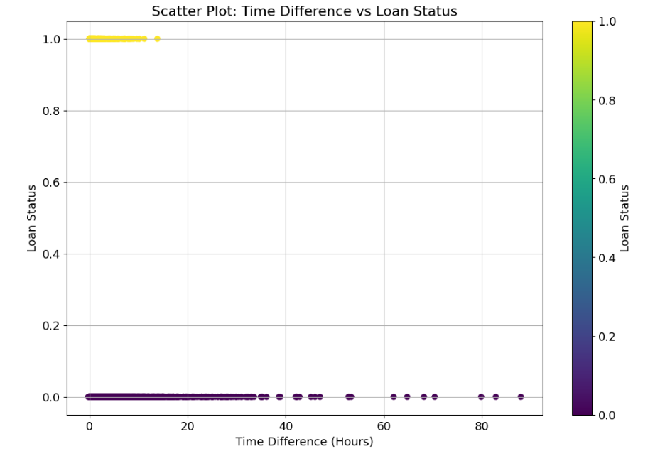

# RealWorld-data-Credit-Risk-Analysis

This is a dataset for a take-home assessment of a finance company named Moneylion. The main goal of the notebook is to enhance the company's ability to identify loans at risk of default by creating a model that complements existing screening systems and reduces potential losses.

## Data Understanding
We received a zip file which contains 3 dataframes (loan, payment, clarity underwriting variables).   
Below is a summarization of these 3 data frame  
- "loan.csv": Our key data frame   

- "payment.csv": Consists payment info that comes after loan approval. Since our model's goal is to act as a secondary safety measure prior to loan approval, this dataset will be excluded to avoid information leakage. 

- "clarity_underwriting_variables.csv": This dataset encompasses variables retrieved from clarity, aiding in the underwriting process of loans. In simpler terms, it involves assessing the risk associated with a loan by evaluating various factors (columns) to determine the probability of the borrower repaying the loan. Upon reviewing the dataset, it appears that the "clearFraudScore" serves as a summarizing score derived from all other columns in the dataset. We assume that all other columns are well represented by this particular column. Consequently, we may consider dropping all other columns to streamline our dataset and reduce dimensionality. 

## Important Preparation

As per our objective, our model aims to serve as a complementary to the current screening system. We will narrow down our focus to loans that **have been funded**. From here, we will further dive in and hopefully provide a more in-depth analysis.

Also, we decided on the "Return Item" under the loan status column as our target variable as it indicates a missed payment due to insufficient funds. Noted this is just an approximation as we are also curious about other loan statuses like "External/Internal collection". However due to the absence of additional information, we've decided to stick with "Return Item" as our primary target variable for now. Further insights could be gained with more detailed data on these other categories.

 

## EDA
In this section, we will categorize the data into three types: Categorical, Datetime, and Numerical data. We will process each data type separately, create new features where applicable, and provide business insights to the company.

### We first start with categorical columns:  
  
  
Finding: 

- Semi-monthly and monthly repayment schedules have nearly twice the likelihood of loan default compared to biweekly and weekly repayments. This is likely because weekly payments involve smaller amounts each time. As a business strategy, the company should consider promoting more frequent repayment schedules to reduce the risk of loan defaults.
- We observed that lead costs between 25 and 50 are associated with the highest default risk. Upon further investigation, we found that these leads are categorized as "lead" in the lead type column. MoneyLion is advised to reduce the approval rate for this category to mitigate risk.
- The history of paid-off loans does not significantly impact the associated default risk.
- Many states have a loan default rate of 10% or higher. It is recommended that the company reduce loan approvals in these states, with particular attention to Virginia (VA), which has a 20% default rate.
- Our dataset shows a significant class imbalance, which we will address in the modelling section.

### Next, we will look at datetime columns:

  

- loanStatus 0 = no late repayment, loanStatus 1 = late repayment  

Finding:
- November to February: higher loan demand + higher incidence of late repayments
- April to October: no instances of late repayment 

Based on the finding above, we may infer that people tend to borrow a loan when it comes to the holiday season(Christmas, Newyear) where they are more likely to make impulse purchases which they couldnt afford, thats why we see a late of repayment in the following few months. But those who ask for loan during the middle of the year exhibit a commendable record of timely repayment. **This may be a good business insight for the company as we can reduce loans during the holiday season while increasing loans during the normal season to maximize profit while minimising the risk of default loans.**
 

  
Originated: when the lender officially approves the application and agrees to give the money  

Finding:
- Most loan application is originated within 40 hours
- **All** late repayment loan is originated within 17 hours

**We've noticed a trend where loans with longer originated times are less likely to default**. Assuming we have an SOP before origination, we wonder why some of the loans have a longer origination time, does it include any extra information collection process? Can we apply that to applicantions with a shorter origination time? However, due to the lack of detailed information, we are unable to delve deeper into this matter at present.

## Modeling
In this section:
- We address the issue of imbalanced datasets using the Upsampling method, specifically employing Random Sampling in this instance.
- Subsequently, we utilize LGBM to compute the final AUC score.

Please note that given the nature of this data science assessment, we aim to keep the modelling section as concise as possible. However, for further model enhancement, consider the following approaches:
1. Experiment with different upsampling methods such as SMOTE or its extensions. If utilizing SMOTE, ensure to handle missing values accordingly.
2. Conduct hyperparameter tuning using tools like HyperOpt or Optuna to fine-tune our model.
3. Explore various types of K-fold validation techniques to validate the robustness of the final outcome.
   

After running the model, we have achieved an AUC score of approximately 85.67%, indicating that the model effectively discriminates between True Positives (instances correctly predicted as high risk and proven to default) and False Positives (instances incorrectly predicted as high risk but not proven to default). Also based on the diagram above we can observe that our new feature serves as the main contributor to the model!

## Future Discussion
Throughout our analysis, we've encountered limitations in feature engineering due to the current dataset's scope. We assumed that the clear fraud score is derived solely from the other columns in the clarity_underwriting_variables dataset. To gain a more comprehensive understanding and improve our predictive capabilities, we may need to access additional information such as:

- Income: This data would allow us to assess whether a loan is financially feasible for an individual.
- Family members: Understanding the borrower's family size can provide insights into their family expenses, such as:
  - Income divided by the number of children
  - Income divided by the total number of family members
  - Proportion of children among family members (number of children divided by family members)
- Employment history: Examining the borrower's work history can help gauge the stability of their income source. For example:
  - Longer tenure at the same company may indicate a stable income and lower risk of default.
- Application history across different financial institutions: Knowing how many loans borrowers have applied for at various institutions can offer valuable context and potential risk indicators.
